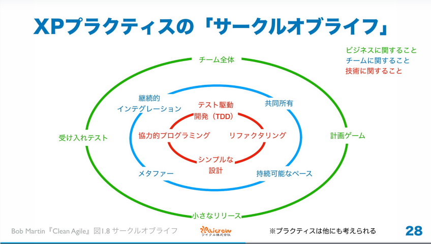

# Clean Craftsmanship
### 第1章　クラフトマンシップ
- プログラマー人口：3～5年で倍増 → 全プログラマーの半数が新人
- 仕事の規律・基準・倫理を学んでいない → 見習いのまま
  
## 第I部　規律
#### エクストリームプログラミング
- 最も適切に定義され、最も完全なアジャイル手法
- サークルオブライフ：XPのアジャイルプラクティス  

- 規律：以下の5つのプラクティス
  - テスト駆動開発
  - リファクタリング
  - シンプルな設計
  - 協力的プログラミング
  - 受け入れテスト
#### テスト駆動開発
- 最も基本的な内容（これがないと何もできない）
- 信頼できるテストを構築する
#### リファクタリング
- クリーンなコードを書くため
#### シンプルな設計
- リファクタリングがなければ実現できない
- 設計センス
#### 協力的プログラミング
- チームが協力する規律と技芸
#### 受け入れテスト
- ソフトウェア開発チームとビジネスを結びつける規律

### 第2章　テスト駆動開発
#### 概要
- 目的（以下の規律をもたらす）
  - 信頼できるテストスイートを作成する
  - 適度に分離された本番コードを作成する
  - 極端に短いサイクルのフィードバックループを作成する
  - テストコードと本番コードを相互に分離させる
- TDD3つの法則＋α
  - 第1の法則  
    テストを書くまで本番コードを書いてはならない。本番コードがないためテストは失敗する。
  - 第2の法則  
    失敗するテストやコンパイルできないテストを必要以上に書いてはならない。失敗を解決するには本番コードを書く。
  - 第3の法則  
    失敗しているテストを解決する本番コードを必要以上に書いてはならない。テストがパスしたら、追加のテストを書く。
  - 第4の法則  
    Red → Green → Refactor
- TDDの効果
  - 動作するコードを書く時間が増え、動作しないコードのデバッグ時間が減る
  - ほぼ完璧な超低レベルのドキュメントを作れる
  - 楽しい
  - 自信を持ってデプロイができるようになるテストスイートを作れる
  - 結合の少ない設計ができる
  - テストスイートがあれば、コードを安全にクリーンにできる
#### 基本
- [スタック](clean_craftmanship/clean_craftsmanship_stack.mp4)
  - ルール1：書きたいことがわかっているコードを書くためのテストを書く。
  - ルール2：失敗させる。パスさせる。クリーンにする。
  - ルール3：金メダルを目指さない。
- [素因数分解](clean_craftmanship/clean_craftsmanship_primefactors.mp4)
  - ルール4：最も単純で、最も具体的で、最も退化した、失敗するテストを書く。（1の素因数でnullを返す）
  - ルール5：可能な限り一般化する。
- [ボーリング](clean_craftmanship/clean_craftsmanship_bowlinggame.mp4)
  - ルール6：コードが間違っていると思ったら、先に進む前に設計を修正する。
#### 結論
### 第3章　テスト駆動開発応用
#### ソート1
- [バブルソート](clean_craftmanship/clean_craftsmanship_sort1.mp4)
#### ソート2
- [クイックソート](clean_craftmanship/clean_craftsmanship_sort2.mp4)
  - ルール7：複雑なケースをテストする前に、現在のシンプルなケースをやり尽くす。
#### 行き詰まり  
- 行き詰まり
  - ルール8：テストをパスさせるための実装が多すぎる場合は、そのテストを削除して、より簡単にパスできるシンプルなテストを書く。
  - ルール9：テストの領域をカバーする意図で段階的なパターンに従う。
#### AAA（準備、実行、アサート）
- 3Aパターン
  - 準備(Arrange)：テストでーたの準備
  - 実行(Act)：テストする関数の呼び出し
  - アサート(Assert)：実行の出力を調べる
- BDD（ビヘイビア（振る舞い）駆動開発）
  - 前提：テストデータが準備できている
  - もし：テストを実行する
  - ならば：期待される結果をアサートする
- すべてのテストはシステムの振る舞いを記述する有限状態機械の遷移である
#### テストダブル
- テストダブル
  - ダミー：インターフェイスを何もせずに実装するテストダブル
    - ルール10：テストに必要ないものをテストに含めてはならない。
  - スタブ：何もせずに実装するダミー（テストが実行したい経路に関数を仕向けるための値を返す）
    - ルール11：テストから本番用のデータを使ってはならない。
  - スパイ：スパイはスタブ（スパイは何が行われたかを記憶しており、テストから問い合わせができる）
  - モック：モックはスパイ（何が期待されているのか把握しており、期待に基づいてテストを成功、失敗させる）
    - スパイ、モックはコードとテストが結合する
  - フェイク：シミュレータ
- TDDの不確定性原理：確定性を求めるならば、テストの柔軟性は低下する。テストに柔軟性を求めるならば、確定性は低下する
- ロンドン学派：確定性＞柔軟性＝アウトサイドインの設計
- シカゴ学派：確定性＜柔軟性＝インサイドアウトの設計
#### アーキテクチャ
- トレードオフは「アーキテクチャ」レベルの話
#### 結論
### 第4章　テスト設計
#### データベースのテスト
1. データベースをテストするな
2. データベースをビジネスルールから切り離せ
#### GUIのテスト
1. GUIをテストしない
2. GUI以外のすべてをテストする
3. GUIは思っているよりも小さい
#### テストパターン
- テスト用サブクラス
- 自己短絡
- 質素なオブジェクト
#### テスト設計
- 壊れやすいテストの問題
  - 1対1の対応関係
    - ルール12：テストの構造を本番コードの構造から分離する
  - 対応関係の解消
  - 具体化と一般化
    - ルール13：テストを具体的にすれば、コードは一般化される
#### 変換の優先順位説
1. {} → Nil
2. Nil → 固定値
3. 固定値 → 変数
4. 無条件 → 選択
5. 値 → リスト
6. 選択 → 反復
7. 文 → 再帰
8. 値 → 変異値
  - ルール14：ある変換で最適なソリューションにならなければ、別の変換を試してみる
#### 結論
### 第5章　リファクタリング
- コンピューターが理解できるコードは誰にでも書ける。すぐれたプログラマーは、人間にとってわかりやすいコードを書く。
#### リファクタリングとは？
- ソフトウェアの振る舞いを保ったまま、構造を改善していく一連の小さな変更である。このことは、変更するたびに包括的なテストスイートをパスさせることで証明できる。
- 目的：コードをクリーンにすること（Red → Green → Refactor）
  - ルール15：デバッガーを使ってはならない。
#### 基本的なツールキット
- IDEの自働化を覚えることを推奨する
  - 名前の変更
  - メソッドの抽出：逓減規則＝コードは上から下へ読めるように書く
  - 変数の抽出
  - フィールドの抽出
#### 規律
- 規律に必要なもの
  - テスト
  - 高速なテスト
  - 1対1の対応関係を解消する
  - 継続的にリファクタリングする
  - 容赦ないリファクタリング
  - テストをパスさせ続けろ
  - 逃げ道を残しておく(git reset --hard)
#### 結論
- マーチン・ファウラー「リファクタリング」を読め
### 第6章　シンプルな設計
- システムの最高の設計
  - 機能要件をすべて満たし、変更に対して柔軟性があるシンプルな設計である。
  - シンプル＝もつれていない。絡み合っていない。＝抽象化
#### YAGNI
- YAGNI(Tou aren't gonna need it.)：それは必要にならない
#### テストでカバーする
- シンプルな設計のルール(Extreme Programming Explainned)
  1. システム（コードとテスト）はあなたが伝えたいものをすべて伝えなければならない。
  2. システムは重複するコードを含んではならない。
  3. システムは最小限のクラスを持たなくてはならない。
  4. システムは最小限のメソッドを持たなけらばならない。
- 2011年
  1. テストをパスさせる
  2. 意図を明らかにする
  3. 重複を排除する
  4. 小さい
- 2015年
  1. テストをパスさせる
  2. 意図を明らかにする
  3. 重複を排除する
  4. 要素を最小限にする
- 本書
  1. テストでカバーする
     - カバレッジ：テスト可能なコードは分離されたコードである 
#### 表現の最大化
- システム（コードとテスト）はあなたが伝えたいものをすべて伝えなければならない。
#### 重複の最小化
- 偶然の重複は排除すべきではない（目的が異なるため、変化の方向が違う）
#### サイズの最小化
- テストをパス → 表現力を高める → 重複をなくす → 関数のコードサイズを減らす
### 第7章　協力的プログラミング
- ペアプログラミング
- モブプログラミング
### 第8章　受け入れテスト
- テストを自働化する
#### 規律
- 中間目標：BAとQAが読むことができるテスト
- 最終目標：BAとQAが読むことがテストをかけるようになる
#### 継続的ビルド
- テストがテストスイートに組み込まれる → 継続的ビルド
## 第II部　基準
- ベースラインとなる「期待」
#### あなたの新しいCTO
### 第9章　生産性
#### 絶対にS**Tを出荷しない
- 絶対にS**Tを出荷しない期待
#### 安価な適応力
- 変更するスコープに比例したコストで開発チームが対応できることを期待
#### 常に準備万端
- ビジネス側がリリースを決めた時にリリースできるという期待
#### 安定した生産性
- 常に変更が容易であるという期待
### 第10章　品質
#### 継続的改善
- 時間の経過とともにシステムやアーキテクチャが改善されることを期待
#### 恐れを知らない能力
- 変更に恐れを知らない能力を期待
#### エクストリームな品質
- エクストリームな品質を期待
#### QAを軽視しない
- QAを軽視しないことを期待
#### QAは何も発見しない
- QAが何も発見しないことを期待
#### テストの自動化
- 自働化できるテストを自働化する期待
#### 自動テストとユーザーインターフェイス
- 自動テスト：ユーザーインターフェイスでビジネスルールをテストしてはならない（UIは変更されやすい）
#### ユーザーインターフェイスのテスト
- 関数呼び出し可能なAPI → ビジネスルールから分離（スタブ）を利用
### 第11章　勇気
#### お互いをカバーする
- チームメンバーがお互いにカバーしあうことを期待
#### 正直な見積り
- 正直な見積りを期待
  - 正しい見積り＝「わからない」
  - アジャイルのストーリーポイント
#### 「ノー」と言う
- 答えが「ノー」のときは「ノー」ということを期待
#### 継続的挑戦的学習
- 継続的挑戦的学習者であることを期待
#### メンタリング
- すべてのプログラマーがメンターになることを期待
## 第III部　倫理
#### 最初のプログラマー
#### 75年
- 3年でプログラマーが2倍
- 現在、5年でプログラマーが2倍（5年後、半数が5年以内のキャリア）
#### オタクから救世主へ
#### ロールモデルと悪役
#### 我々が世界を支配する
- 我々が世界を支配している＝世界を動かすルールを書いている
#### 大惨事
- バグによる大惨事も多い
#### プログラマーの誓い
1. 私は、有害なコードを作らない。
2. 私が作るコードは、常に私の最高傑作である。振る舞いや構造に欠陥のあるコードを故意に残すことはしない。
3. 私は、コードが正常に動作する証拠をリリースごとに用意する。それは、迅速で、確実で、再現可能な証拠である。
4. 私は、誰かの進歩を妨げないように、小さく何度もリリースする。
5. 私は、あらゆる機会において、恐れることなく執拗に私の作品を五改善する。決して作品を劣化させることはしない。
6. 私は、私や誰かの生産性を高めるために、できる限りのことをする。決して、生産性を落とすようなことはしない。
7. 私は、他の人が私をカバーできるように、私が他の人をカバーできるようにつとめる。
8. 私は、規模と精度の両方を正直に見積もる。合理的な確実性がないときには約束をしない。
9. 私は、仲間のプログラマーの倫理、基準、規律、スキルを尊重する。その他の属性や特性を尊重の要因にすることはしない。
10. 私は、私の技術の学習と向上を怠らない。
### 第12章　有害
#### 第一に、害を与えてはならない
- 社会
- 機能
- 構造
- ソフト（柔軟性）
- テスト
#### 最高傑作
- 正しくする（クリーン）
- 良い構造＝依存関係の管理（SOLID原則）
- 緊急と重要
  - やるのは重要なことのみ
- プログラマーもステークホルダー＝自分の意見を表明する
- ベストを尽くす
#### 再現可能な証拠
- テストは証明である
### 第13章　誠実
#### 小さなサイクル
- バージョン管理システムの進化
  - 継続的ビルド
  - 継続的デプロイ
#### 容赦ない改善
- テストとリファクター
#### 高い生産性を維持する
1. 効率化：開発環境を効率的にする
2. 集中力：仕事とプライベートを大切にする
3. 時間管理：退屈な作業時間と生産的な時間を切り分ける
- コード書く以外のこと
  - ビルド：高速化
  - テスト：高速化
  - デバッグ：TDDで短縮
  - デプロイ：自働化
- 集中力
- 時間管理
### 第14章　チームワーク
#### チームとして働く
- オープンオフィス＞バーチャルオフィス
- コミュニケーションを大事に
#### 正直に公正に見積もる
#### 尊重
#### 学習をやめない
